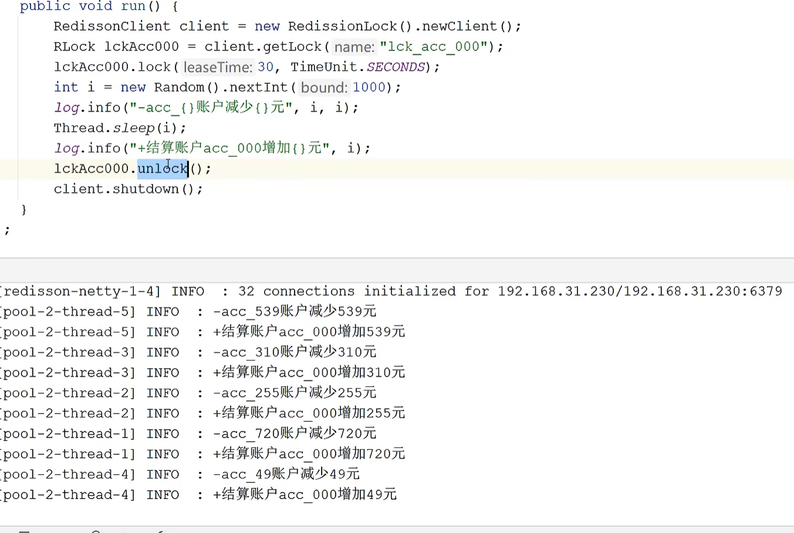

分布式锁一般有三种实现方式：1. 数据库乐观锁；2. 基于Redis的分布式锁；3. 基于ZooKeeper的分布式锁。本篇文章主要介绍第二种方式。
一个完美的分布式锁，必须要满足如下四个条件：

1.互斥性。在任意时刻，只有一个客户端能持有锁。
2.不会发生死锁。即使有一个客户端在持有锁的期间崩溃而没有主动解锁，也能保证后续其他客户端能加锁。
3.具有容错性。只要大部分的Redis节点正常运行，客户端就可以加锁和解锁。
4.解铃还须系铃人。加锁和解锁必须是同一个客户端，客户端自己不能把别人加的锁给解了。

Redis分布式锁原理：
锁的实现主要基于redis的SETNX命令
SETNX key value将 key 的值设为 value ，当且仅当 key 不存在。若给定的 key 已经存在，则 SETNX 不做任何动作。SETNX 是『SET if Not eXists』(如果不存在，则 SET)的简写。
**返回值：**设置成功，返回 1 。设置失败，返回 0 。
使用SETNX完成同步锁的流程及事项如下：

使用SETNX命令获取锁，若返回0（key已存在，锁已存在）则获取失败，反之获取成功
为了防止获取锁后程序出现异常，导致其他线程/进程调用SETNX命令总是返回0而进入死锁状态，需要为该key设置一个“合理”的过期时间
释放锁，使用DEL命令将锁数据删除

Redis锁的实现方式很多，到时多多少少都有点问题，相对比较完美的方案是使用lua脚本。最完美的解决方案就是使用Redission这个框架里边的RedissionRedLock。具体实现就不给出了，大家可以按照这个思路去查找相关资料。等到我什么时候有时间和精力了再回来补充一下。

